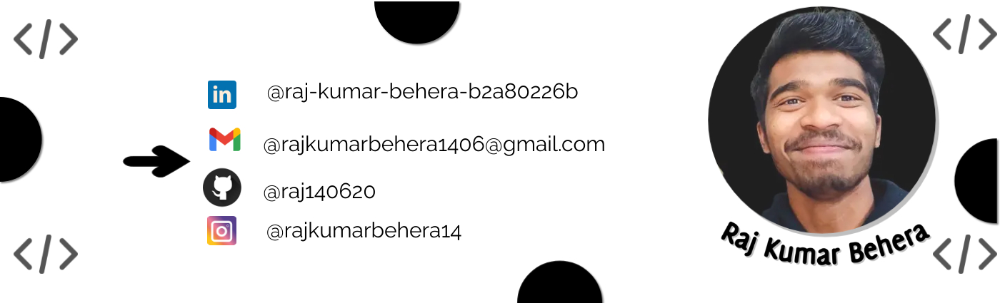

<h1 align="center">Hi 👋, I'm Raj Kumar Behera</h1>
<h2 align="center">A passionate Network & System Admin from India.</h2>

 

  

  

- 🔭 Visit my Portfolio website [https://rajinfotechportfolio.000webhostapp.com/](https://rajinfotechportfolio.000webhostapp.com/)

- 🌱 I’m currently learning **Linux And Windows Server**

- 👨‍💻 All of my projects are available at [https://github.com/Raj140620](https://github.com/Raj140620)

- 💬 Ask me about **Network & System Administration**

- 📫 How to reach me **rajkumarbehera1406@gmail.com**

- 📄 Know about my experiences [https://flowcv.com/resume/nv197uqbre](https://flowcv.com/resume/nv197uqbre)

- ⚡ Fun fact **As a budding Network and System Admin enthusiast, I once troubleshooted my home network for hours just to discover that my cat had accidentally unplugged the router! 🐱🔌📡 Embracing every challenge, one unplugged cable at a time! 💻🔧 #FreshAdminAdventures"**

<h3 align="left">Connect with me:</h3>

<h3 align="left">Languages and Tools:</h3>

               

&nbsp;

